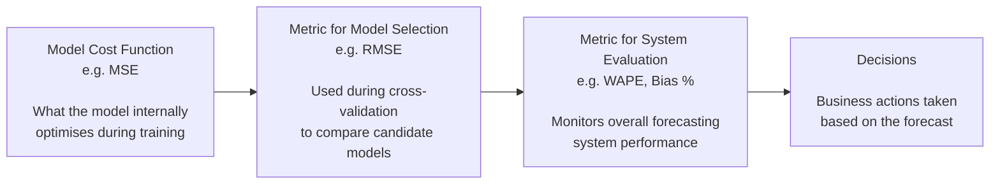
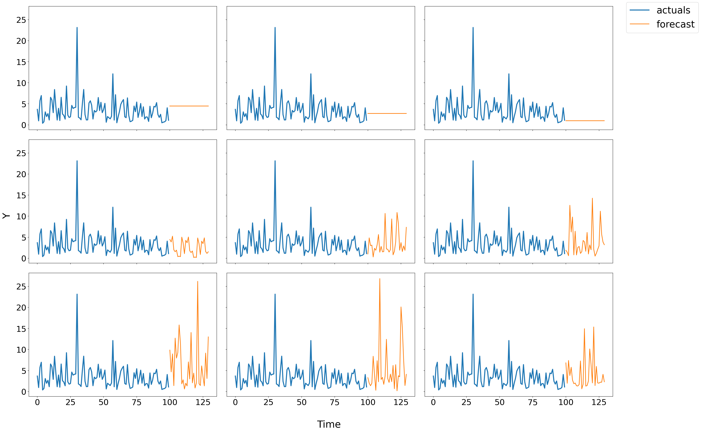
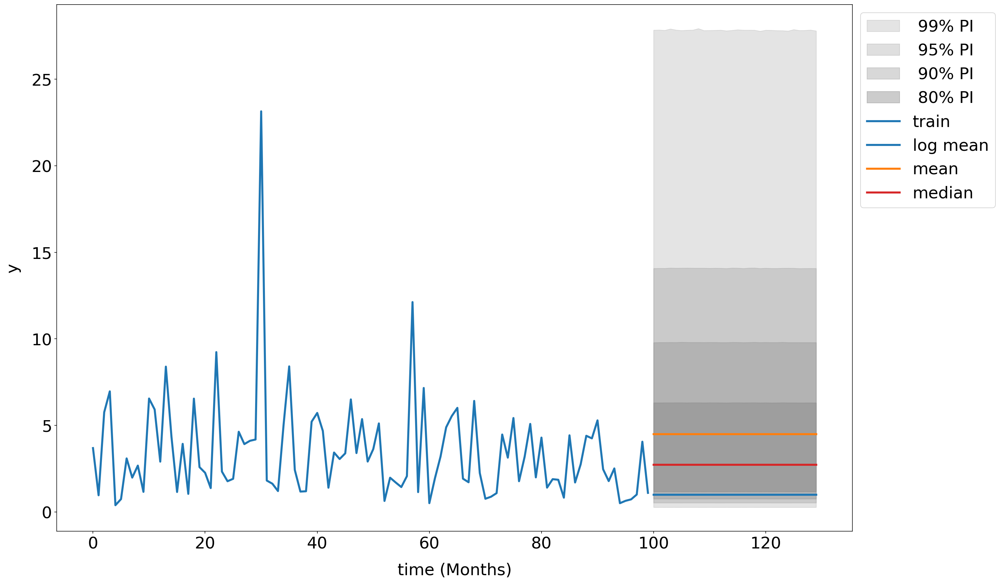
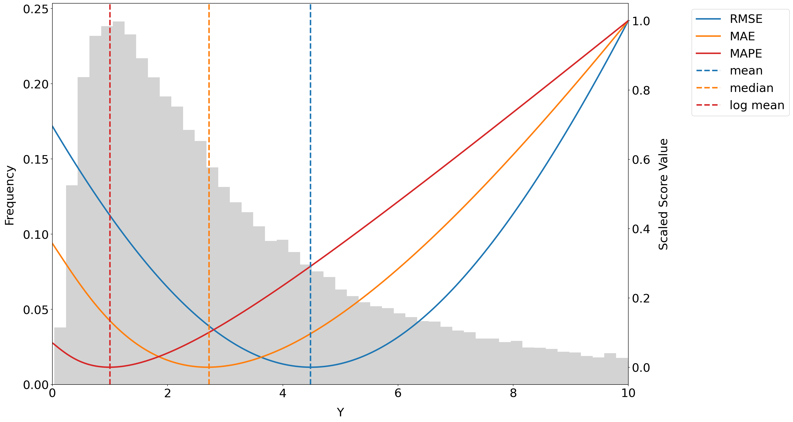
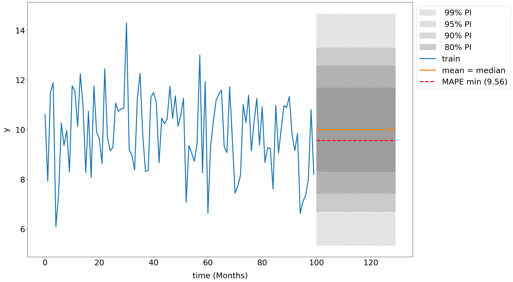
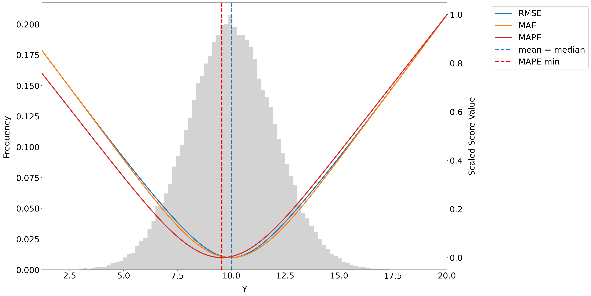

# Forecast performance metrics ADR

## TODOs [will delete this section after doc is complete]

- [ ] Metrics aggregation
- [ ] Dimensions to evaluate the forecast across
- [ ] Fix References and add more resources
- [X] Appendix with presentation 
- [ ] Extrinsic metrics (matching status quo and decisions made)
- [ ] Status quo summary from Alex's doc

## Introduction

When designing a forecasting system, the metrics we use for the overall performance
evaluation and model selection (they don't have to be the same) are **more important** 
than the models we choose.

If we have a proper cross-validation setup, free of any leakage risk, and metrics that are
aligned to the types of decisions we will take using our forecasts, then we will choose
the right models for our use-case. Conversely, if our forecast metrics and/or our cross-
validation setup doesn't match reality and the types of decisions we'll take then, no
matter how great our models are, we're optimizing for the wrong thing.

Forecast metrics are geared towards a **statistical functional** (e.g. mean, median), more formally:
> Effective point forecasting requires that the scoring function be specified ex ante, 
> or that the forecaster receives a directive in the form of a statistical functional, 
> such as the mean or a quantile of the predictive distribution. If the scoring function
> is specified ex ante, the forecaster can issue the optimal point forecast, namely,
> the Bayes rule. If the forecaster receives a directive in the form of a functional,
> it is critical that the scoring function be consistent for
> it, in the sense that the expected score is minimized when following the directive. [[1]](#ref-1)

The diagram below shows all the stages in a forecasting system where a metric choice is involved — from the loss function a model optimises during training, through model selection and system monitoring, to the business decisions the forecasts inform. These don't all have to use the same metric, but they should be aligned.

**Note:** For other use-cases e.g. inventory control, we can also create metrics that are even
closer to the decision levels (e.g. out-of-stock rate, lost sales etc.). Frequently these
require simulations from probabilistic forecasts. We call these metrics extrinsic, while
metrics like RMSE, MAE and MAPE are intrinsic.

Examples of problems with the correct statistical functional / metric pairs based on the
decisions that the forecast will inform:
| Problem | Forecast Output | Metric |
|---|---|---|
| I want at least 99% probability that every patient in need gets a hospital bed | 99% Quantile | Quantile Loss |
| I want to optimize my product inventory to hold as little as possible while not running out of stock, but my lead-time is very unpredictable| Probabilistic | CRPS |
| I want an estimate of my **expected** sales for the year | Mean | RMSE |
| I want to quote delivery lead times that are equally likely to be early or late | Median | MAE |

## Baselines

For metrics to be useful we need to be able to see the relative performance of our system compared
to something else. Therefore, a proper forecasting evaluation setup, always comes with 
a set of reasonable **baselines**. Common baselines are:
* **Automatic forecasting algorithms:** auto.arima, ETS, Theta and simple combinations of them
* **Arithmetic Baselines:** Historical Average, Simple Moving Average, Seasonal Naive, Naive
* **Past forecasts of current forecasting system:** Previous judgemental forecasts

Baselines should be used both in offline evaluation with cross-validation and live monitoring.

## Point Forecast Metrics
Below is a list of relevant forecasting metrics. This is by no means an exhaustive list.

- **MAE — Mean Absolute Error**

$$
\text{MAE} = \frac{1}{n} \sum_{i=1}^{n} \left| y_i - \hat{y}_i \right|
$$

- **RMSE — Root Mean Squared Error**

$$
\text{RMSE} = \sqrt{ \frac{1}{n} \sum_{i=1}^{n} \left( y_i - \hat{y}_i \right)^2 }
$$

- **MAPE — Mean Absolute Percentage Error**

$$
\text{MAPE} = \frac{1}{n} \sum_{i=1}^{n} \frac{\left| y_i - \hat{y}_i \right|}{\left| y_i \right|}
$$

- **WAPE — Weighted Absolute Percentage Error**

$$
\text{WAPE} = \frac{\sum_{i=1}^{n} \left| y_i - \hat{y}_i \right|}{\sum_{i=1}^{n} \left| y_i \right|}
$$

- **Bias Percentage**

$$
\text{Bias Percentage} = \frac{\sum_{i=1}^{n} \left( y_i - \hat{y}_i \right)}{\sum_{i=1}^{n} \left| y_i \right|}
$$

Where (for all metrics above):

- $n$ — the number of observations
- $y_i$ — the actual value at time $i$
- $\hat{y}_i$ — the forecast value at time $i$

**Scale dependence:** A metric is scale-dependent if its value depends on the units and magnitude of the data. For example, an MAE of 100 means very different things for a series measured in thousands vs. one measured in single digits. Scale-dependent metrics (MAE, RMSE) cannot be compared across series with different scales. Scale-independent metrics (MAPE, WAPE, Bias Percentage) normalise by the actuals, making them comparable across series — but at the cost of other trade-offs (e.g., undefined at zero, asymmetric penalties). At a minimum, metrics in different units of measurement (e.g. number of apples and number of oranges, British pounds and Swiss francs) should not be aggregated together.

### Summary Table

| Metric | Scale-Dependent | Optimised by | Comments |
|---|---|---|---|
| MAE | Yes | Median |  |
| RMSE | Yes | Mean | aligned with cost function of most models |
| MAPE | No | 🤷 see [[1]](#ref-1) for more details| Penalises over-forecasts less than under-forecasts; undefined when $y_i = 0$ |
| WAPE | No | Median | |
| Bias Percentage | No | Mean | Signed metric; positive = under-forecast, negative = over-forecast |

---

For a more extensive summary table and detailed analysis of the properties of each metric have a look at [[2]](#ref-2).

## Metrics for multiple time-series
When we need to take decisions on a single time series (e.g. model selection) whether the
metric is scale dependent or not is not a factor. However, if we're aggregating the raw
errors or the metrics of multiple time series, then we need to consider the units and the scale.

Aggregated metrics are important for tracking the overall performance of our forecasting
system. Decisions are usually taken based on individual time series, but for commercial applications it's important that time series are weighted based on their
importance. Usually importance means value.

There are 2 ways to create scores for the performance of multiple time series: 
1. Compute single time series metrics (RMSE, MAE, WAPE etc.) and then aggregate them using
weights.
2. Compute metrics based on the raw errors of the time (series) and scale / weigh them
after.

For the purposes of auditing performance and taking deliberate decisions on how to weigh
different time series, it's always better to go with the former approach.

> In most cases, weights can be constructed in a way where these 2 methods are mathematically
> equivalent. For example, WAPE computed across all time series can be decomposed as:
> 
> $$
> \text{WAPE}_{\text{total}} = \frac{\sum_{i=1}^{N} \sum_{t=1}^{T} |y_{ti} - \hat{y}_{ti}|}{\sum_{i=1}^{N} \sum_{t=1}^{T} |y_{ti}|} = \sum_{i=1}^{N} w_i \cdot \text{WAPE}_i = \frac{T}{\sum_{i=1}^{N} \sum_{t=1}^{T} |y_{ti}|} \sum_{i=1}^{N} \text{MAE}_i
> $$
> 
> Where $\text{WAPE}_i = \frac{\sum_{t=1}^{T} |y_{ti} - \hat{y}_{ti}|}{\sum_{t=1}^{T} |y_{ti}|}$ is the WAPE of series $i$,
> $w_i = \frac{\sum_{t=1}^{T} |y_{ti}|}{\sum_{k=1}^{N} \sum_{t=1}^{T} |y_{tk}|}$ is the weight for series $i$ (its share of total absolute actuals),
> and $\text{MAE}_i = \frac{1}{T} \sum_{t=1}^{T} |y_{ti} - \hat{y}_{ti}|$ is the standard MAE of series $i$.
> In other words, high-value series naturally dominate the aggregate WAPE — which is often
> desirable but should be a **deliberate** choice.

## Forecast Stability

Compared to a judgemental forecast, a simple forecasting system can exhibit high changes
month-over-month for forecasts of the same target period. There are practical reasons why
this can be a problem:
* Any judgemental adjustments on top of the algorithmic forecast will have to be revisited
* Downstream decisions will have to be revisited too (e.g. production schedule of a factory)

As a result, modern forecasting best practices suggest that while optimising for accuracy
we also need to monitor forecast stability.

As a first step, we need to monitor a forecast stability metric.

TODO: Add picture of stable VS non-stable forecast

There are a few stability metrics that have been recently introduced. [[3]](#ref-3) offers a good 
analysis and comparison. Of these, sMAPC(V) —
symmetric Mean Absolute Percentage Change (Vertical) [[3]](#ref-3) is a very good compromise between
statistical properties and interpretability for non-technical stakeholders.

$$
\text{sMAPC(V)}
= \frac{2}{n}
\sum_{i=1}^{n}
\frac{
\left| \hat{y}_{t+i \mid t} - \hat{y}_{t+i \mid t-1} \right|
}{
\left| \hat{y}_{t+i \mid t} \right| + \left| \hat{y}_{t+i \mid t-1} \right|
}
$$

Where:

- $n$ — the number of forecast horizons being compared
- $t$ — the earlier forecast origin
- $i$ — the forecast horizon index ($i = 1, 2, \dots, n$)
- $\hat{y}_{t+i \mid t}$ — the forecast made at origin $t$ for target period $t + i$
- $\hat{y}_{t+i \mid t-1}$ — the forecast made at origin $t-1$ for the same target period $t + i$

**Intuition:** For each target period $t + i$, the metric compares the two forecasts
produced from adjacent forecast origins that share the same target. The symmetric percentage form ensures the measure is scale-independent similar to symmetric MAPE.

### Aggregation across multiple forecast origins

When there are $T$ forecast origins, compute sMAPC(V) for each consecutive pair and take the arithmetic mean:

$$
\overline{\text{sMAPC(V)}} = \frac{1}{T-1} \sum_{t=2}^{T} \text{sMAPC(V)}_t
$$

Where $\text{sMAPC(V)}_t$ is the metric for the vintage pair $(t, t-1)$.

## Appendix - Presentation material

### Pick the right forecast

### What forecast optimizes each metric

### What about the normal distribution?

### References
[1] Tilmann Gneiting (2011). Making and Evaluating Point Forecasts. *Journal of the American Statistical Association*, 106(494), 746–762. https://arxiv.org/abs/0912.0902

[2] Hansika Hewamalage, Klaus Ackermann, & Christoph Bergmeir (2023). Forecast evaluation for data scientists: common pitfalls and best practices. *Data Mining and Knowledge Discovery*, 37, 788–832. https://doi.org/10.1007/s10618-022-00894-5

[3] Rakshitha Godahewa, Christoph Bergmeir, Zeynep Erkin Baz, Chengjun Zhu, Zhangdi Song, Salvador García, & Dario Benavides (2025). On forecast stability. *International Journal of Forecasting*, 41(4), 1539–1558. https://doi.org/10.1016/j.ijforecast.2025.01.006

[4] TODO Dutch guy's paper